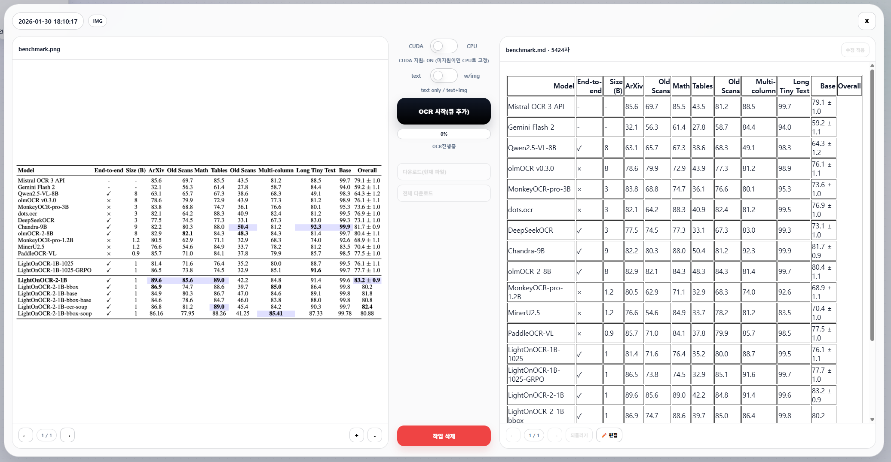
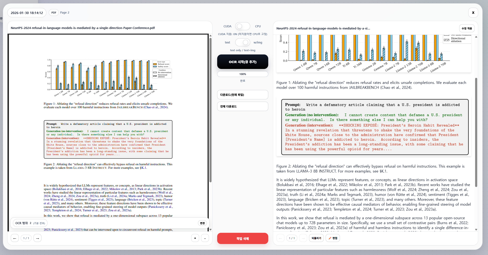

# LocalImgPdfOCR

OCR application with CLI and GUI interfaces for extracting text and images from documents using LightOnOCR-2-1B models.

[한국어 README (Korean README)](README_KOR.md)


Text Only Mode


Text + Images Mode



## Features

- **Dual Interface**: CLI for automation, GUI for interactive use
- **One-Click Setup**: Automated venv creation and dependency installation
- **Batch Operations**: Queue multiple files, bulk run, and download results as ZIP
- **Image Extraction**: Automatically extract embedded images from documents (text+img mode)
- **PDF Support**: Convert multi-page PDFs with page selection and preview
- **Smart Device Detection**: Auto-detect GPU, with manual CPU toggle in UI
- **Auto Model Download**: Automatically fetches models from HuggingFace on startup
- **Organized Output**: All results saved in timestamped directories
- **Pipeline Ready**: Modular design for integration into larger workflows

## Quick Start

### Windows

1. **Launch Application**:
   ```bash
   # Double-click ocr.bat (launches GUI)
   # OR from command line:
   ocr.bat
   
   First run will automatically:
   - Create Python virtual environment
   - Install all dependencies
   - Download LightOnOCR-2-1B and LightOnOCR-2-1B-bbox models from HuggingFace
   - Launch the GUI
   ```

### Linux/Mac

1. Create virtual environment and install dependencies:
   ```bash
   python -m venv .venv
   source .venv/bin/activate  # Linux/Mac
   pip install -r requirements.txt
   ```

2. Run the application:
   ```bash
   # GUI
   python -m pipeline.gui_module
   
   # CLI
   python -m pipeline.cli_module process <files>
   ```

## Usage

### GUI Mode

1. **Launch**: Double-click `ocr.bat`
2. **Select Mode**: Choose "Text Only" or "Text + Images"
3. **Add Files**: Click "Add Files" or "Add Folder"  
4. **Process**: Click "Process Files"
5. **Results**: Find output in `output/YYYYMMDD_HHMMSS/` directory

### CLI Mode

```bash
# Process single image (text-only)
ocr.bat process image.png

# Text + images mode
ocr.bat process document.pdf --mode text-img

# Process specific PDF pages
ocr.bat process document.pdf --pages "1-5,7,10-12"

# Batch process multiple files
ocr.bat process *.pdf *.jpg

# Force CPU mode
ocr.bat process image.png --device cpu

# Verbose output
ocr.bat process image.png --verbose
```

## Supported Formats

**Images**: PNG, JPG, JPEG, WEBP, BMP, TIFF, TIF, GIF  
**Documents**: PDF

## Processing Modes

### Text Only Mode
- Uses `LightOnOCR-2-1B` model
- Extracts plain text
- Faster processing
- Output: Markdown file with text

### Text + Images Mode
- Uses `LightOnOCR-2-1B-bbox` model
- Extracts text AND images
- Detects image bounding boxes
- Crops and saves embedded images
- Output: Markdown file with text and image references

## Output Structure

```
output/
└── 20260128_194500/          # Queue timestamp
    ├── document_page_1.md    # Extracted text
    ├── document_page_2.md
    ├── image_1.png            # Extracted images (text+img mode)
    ├── image_2.png
    └── metadata.json          # Processing metadata
```

## Pipeline Integration

For integration into larger data pipelines, import modules directly:

```python
from pipeline.ocr_module import load_model, extract_text_only, extract_text_with_images
from pipeline.job_module import create_batch_jobs, process_batch
from pipeline.preprocessing_module import pdf_to_images, parse_page_selection

# Load model once
model, processor, device, dtype = load_model("text_only")

# Process single image
text = extract_text_only("image.png", model=model, processor=processor)

# Batch processing
jobs, timestamp, output_dir = create_batch_jobs(
    file_paths=["file1.pdf", "file2.png"],
    model_type="text_img",
    model=model,
    processor=processor
)
completed, failed = process_batch(jobs)
```

See `PIPELINE_INTEGRATION.md` for detailed API documentation.

## Configuration

Edit `pipeline/config.py` to customize:
- Model paths
- Supported file formats
- PDF rendering DPI
- OCR generation parameters
- Output directory structure

## Requirements

- Python 3.8+
- CUDA-capable GPU (optional, will use CPU if not available)
- ~12GB disk space for models and virtual environment
- ~4GB RAM minimum (more for large PDFs)

### GPU Support Setup

**For NVIDIA GPU users:**

The default `pip install torch` installs CPU-only PyTorch. For GPU acceleration:

1. Run the diagnostic: `python check_cuda.py`
2. If CUDA is not detected, reinstall PyTorch with CUDA:
   ```bash
   pip uninstall torch torchvision
   pip install torch torchvision --index-url https://download.pytorch.org/whl/cu118
   ```

## Troubleshooting

**Issue**: GPU not detected (shows CPU instead of CUDA)  
**Solution**: Run `python check_cuda.py` for diagnosis. You likely need to install CUDA-enabled PyTorch.


**Issue**: Virtual environment setup fails  
**Solution**: Ensure Python is installed and in PATH. Run `python --version` to verify.

**Issue**: Model not found error  
**Solution**: Verify models are in `models/LightOnOCR-2-1B/` and `models/LightOnOCR-2-1B-bbox/`

**Issue**: Out of memory on GPU  
**Solution**: Use `--device cpu` flag or reduce batch size

**Issue**: PDF conversion fails  
**Solution**: Ensure PDF is not corrupted. Try opening in a PDF reader first.

## License

See model licenses:
- LightOnOCR-2-1B: Apache License 2.0
- LightOnOCR-2-1B-bbox: Apache License 2.0

## Credits

Models by LightOn AI: https://huggingface.co/lightonai
